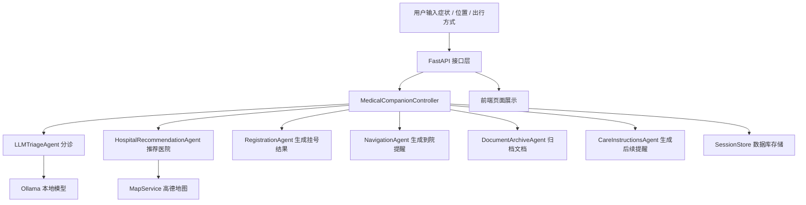

# 项目架构说明

这份文档的目标不是“炫技术名词”，而是用尽量通俗的方式说明：

1. 这个项目的核心框架是什么
2. 系统整体是怎么跑起来的
3. 每一层代码分别负责什么
4. 每个关键文件具体是做什么的

---

## 一、先用一句话理解整个项目

这个项目是一个**面向老年人的就医陪诊 Agent 系统**。

它把就医流程拆成几个连续步骤：

- 先说哪里不舒服
- 判断应该挂什么科
- 推荐更合适的医院
- 给出挂号和到院提醒
- 保存检查资料并生成后续提醒

所以它不是单纯的“聊天页面”，而是一个**任务型 Multi-Agent 系统**。

---

## 二、核心框架是什么

### 1. 后端主框架：FastAPI

`FastAPI` 是这个项目的服务入口。

它负责：

- 对外提供接口
- 接收前端提交的数据
- 调用 Controller 和各个 Agent
- 把结果返回给网页

可以把它理解成“项目的大门”。

---

### 2. 数据结构框架：Pydantic

`Pydantic` 用来定义：

- 用户请求长什么样
- 医院推荐结果长什么样
- 挂号结果长什么样
- 文档归档结果长什么样

它的作用是：

- 保证数据格式统一
- 保证前后端字段清晰
- 让 Agent 之间传递数据更稳

可以把它理解成“项目里的统一表单模板”。

---

### 3. 持久化框架：SQLAlchemy

`SQLAlchemy` 用来把数据保存到数据库。

它负责：

- 保存一次就医 session
- 保存候选医院结果
- 保存挂号结果
- 保存归档文档
- 保存 Agent trace
- 保存 LLM 调用日志

可以把它理解成“项目的数据仓库管理员”。

---

### 4. 本地模型框架：Ollama

`Ollama` 用来运行本地 LLM。

在这个项目里，它主要负责：

- 症状理解
- 分诊建议结构化输出

这样项目就不一定依赖 OpenAI 之类的云 API，也更适合本地演示。

---

### 5. 地图服务：高德地图 Web API

高德负责：

- 地址转经纬度
- 搜索附近医院
- 路线规划
- 返回具体的地铁 / 公交 / 步行 / 驾车路线

它让医院推荐不再是“写死的数据”，而是具备真实路线能力。

---

### 6. 前端框架：原生 HTML/CSS/JS

当前前端没有引入 React 或 Vue，而是使用原生页面。

这样做的优点是：

- 启动快
- 结构简单
- 非常适合演示型项目
- 调样式方便

---

## 三、系统整体是怎么跑的

可以把整套系统想成下面这条流水线：

### 这条链路怎么理解

1. 用户先在网页输入症状和位置。
2. `FastAPI` 接到请求。
3. `Controller` 判断要调用哪些 Agent。
4. 分诊 Agent 先决定该挂什么科、紧急程度如何。
5. 医院推荐 Agent 再结合地图、规则、医院库筛医院。
6. 用户确认后，挂号 Agent 生成挂号信息。
7. 导航 Agent 生成“几点到、去哪层、怎么走”的文字。
8. 如果用户上传检查资料，文档 Agent 负责归档。
9. 最后注意事项 Agent 生成老人更容易看懂的提醒。
10. 这些结果都会存进数据库，形成一条完整 session。

---

## 四、项目分层结构

### 1. 展示层

就是用户直接看到的页面。

- 输入症状
- 看推荐结果
- 点医院去挂号
- 上传检查图片

对应目录：

- `static/`

---

### 2. API 层

负责把前端请求接进来，再把结果返回出去。

对应目录：

- `app/api/`

---

### 3. Controller 层

这是“总控层”，负责编排 Agent。

对应文件：

- `app/agents/controller.py`

---

### 4. Agent 层

每个 Agent 专注做一件事。

对应目录：

- `app/agents/`

---

### 5. Service 层

Service 不直接做“业务决策”，而是提供底层能力。

例如：

- 查数据库
- 调地图 API
- 启动 Ollama
- 保存上传图片

对应目录：

- `app/services/`

---

### 6. 数据层

负责定义数据库表和初始化数据库。

对应目录：

- `app/db/`

---

### 7. 数据模型层

负责定义所有输入输出的数据结构。

对应目录：

- `app/schemas/`

---

### 8. 配置层

负责读取 `.env` 和全局配置。

对应目录：

- `app/core/`

---

### 9. 工具层

提供文本处理、时间解析等小工具。

对应目录：

- `app/utils/`

---

## 五、顶层文件分别是做什么的

### [README.md](/E:/hospital/README.md)

项目总说明。

它面向第一次打开仓库的人，回答三个问题：

- 这是什么项目
- 怎么运行
- 有哪些亮点

### [.env.example](/E:/hospital/.env.example)

环境变量模板。

告诉别人运行这个项目至少要配什么：

- Ollama 地址
- 模型名称
- 高德 API Key
- 数据库地址

### [.gitignore](/E:/hospital/.gitignore)

告诉 Git 哪些文件不要提交。

这里主要忽略：

- `.env`
- 本地数据库
- 上传图片
- 归档文件
- 缓存目录
- IDE 配置

### [requirements.txt](/E:/hospital/requirements.txt)

项目 Python 依赖列表。

### [run_local.py](/E:/hospital/run_local.py)

本地启动脚本。

它做两件事：

- 初始化数据库
- 启动服务后自动打开浏览器

---

## 六、后端入口文件

### [app/main.py](/E:/hospital/app/main.py)

这是 FastAPI 应用入口。

它负责：

- 创建 `FastAPI` 实例
- 注册路由
- 挂载静态资源目录
- 配置启动生命周期
- 在启动时初始化数据库
- 在启动时预热 Ollama

可以把它理解成“后端总入口文件”。

---

## 七、API 层文件

### [app/api/routes.py](/E:/hospital/app/api/routes.py)

这个文件负责定义所有 HTTP 接口。

它当前提供的主要接口有：

- `GET /api/health`
- `POST /api/intake`
- `POST /api/appointments/book`
- `POST /api/documents/archive`
- `POST /api/documents/archive-image`
- `GET /api/sessions/{session_id}`

它的角色像“前台接待”：

- 接收请求
- 调用 Controller
- 把异常转成 HTTP 错误码

---

## 八、Controller 文件

### [app/agents/controller.py](/E:/hospital/app/agents/controller.py)

这是项目最关键的编排文件。

它负责：

- 创建各个 Agent
- 组织完整流程
- 保存 session
- 保存挂号结果
- 保存归档文档
- 记录 Agent trace

里面主要有三个入口方法：

- `handle_intake()`
  处理“症状输入 + 医院推荐”
- `book_appointment()`
  处理“挂号 + 导航”
- `archive_document()`
  处理“归档 + 后续提醒”

可以把它理解成“总控大脑”。

---

## 九、Agent 层文件逐个说明

### [app/agents/base.py](/E:/hospital/app/agents/base.py)

所有 Agent 的公共父类。

它现在主要提供一个统一能力：

- 生成 `trace`

这样所有 Agent 都能把自己的输入和输出摘要写进日志。

---

### [app/agents/triage_agent.py](/E:/hospital/app/agents/triage_agent.py)

分诊模块。

这个文件里其实有两套分诊逻辑：

#### `RuleBasedTriageAgent`

规则分诊。

适合作为：

- 兜底逻辑
- 无模型时的 fallback
- 老年高风险规则护栏

它做的事包括：

- 识别胸闷、心慌、胃绞痛、骨折等关键词
- 判断是否高风险
- 判断是否可以短时观察
- 判断是否应该尽快就医

#### `LLMTriageAgent`

本地大模型分诊。

它做的事包括：

- 调用 Ollama
- 让模型按 `TriageResult` 输出结构化 JSON
- 用规则逻辑给 LLM 做护栏
- 模型失败时自动 fallback 到规则分诊

这是“AI 分诊入口”。

---

### [app/agents/hospital_agent.py](/E:/hospital/app/agents/hospital_agent.py)

医院推荐模块。

这是项目里最复杂的 Agent 之一。

它负责：

- 根据当前位置搜索附近医院
- 根据科室过滤候选医院
- 根据优先库做特殊规则推荐
- 根据路径、拥挤度、匹配度做综合评分
- 输出前 3 家候选医院

它还有一条重要规则：

- 如果在西安市，且紧急程度是 `soon/urgent`
  就优先用“西安市二甲 / 三甲医院优先库”

可以把它理解成“决策引擎”。

---

### [app/agents/registration_agent.py](/E:/hospital/app/agents/registration_agent.py)

挂号结果生成模块。

它现在并不是直接控制真实医院挂号系统，而是：

- 对本地 mock 医院生成挂号时间
- 对实时搜索医院生成“官网预约引导”

它的输出包括：

- 医院名
- 科室
- 挂号时间
- 候诊地点
- 官网入口
- 到院路线摘要

---

### [app/agents/navigation_agent.py](/E:/hospital/app/agents/navigation_agent.py)

院内提醒模块。

它负责把挂号结果翻译成老人更容易执行的步骤，比如：

- 提前多久到
- 先去哪里签到
- 再去哪里候诊
- 带什么证件

它相当于“就诊行动清单生成器”。

---

### [app/agents/document_agent.py](/E:/hospital/app/agents/document_agent.py)

检查资料归档模块。

它负责：

- 根据标题和文本判断文档类型
- 识别医院名
- 识别科室
- 识别报告日期
- 生成一个简短摘要

它现在是规则抽取，不是 OCR 医疗大模型解析。

---

### [app/agents/instructions_agent.py](/E:/hospital/app/agents/instructions_agent.py)

后续提醒生成模块。

它会结合：

- 分诊结果
- 挂号结果
- 文档类型

来输出：

- 检查后注意事项
- 复诊建议
- 老年友好提示

---

## 十、Service 层文件逐个说明

### [app/services/session_store.py](/E:/hospital/app/services/session_store.py)

Session 持久化服务。

它负责把一整次就医流程保存到数据库中。

主要能力：

- 创建 session
- 读取 session
- 保存 appointment
- 保存 document
- 追加 Agent trace
- 记录 LLM 调用日志

它是“项目的持久化中枢”。

---

### [app/services/hospital_catalog.py](/E:/hospital/app/services/hospital_catalog.py)

普通医院目录服务。

它负责从数据库把普通医院读出来，提供给 Agent 使用。

主要能力：

- 列出医院
- 按 ID 查医院
- 列出所有科室

---

### [app/services/priority_hospital_catalog.py](/E:/hospital/app/services/priority_hospital_catalog.py)

优先医院目录服务。

目前主要服务于西安场景。

它负责：

- 按城市取优先医院库
- 根据医院名或别名做匹配

它的意义是：

- 在紧急场景下，不完全依赖实时搜索结果
- 优先选择可信的二甲 / 三甲医院

---

### [app/services/map_service.py](/E:/hospital/app/services/map_service.py)

地图服务模块。

这是项目第二个非常关键的 Service。

它负责：

- 地理编码
- 解析城市 / 区县
- 搜附近医院
- 路线规划
- 提取地铁 / 公交路线步骤
- 生成兜底路线

它输出的不是原始地图 JSON，而是项目自己的 `MapRouteResult`。

所以前端拿到的已经是：

- 总耗时
- 换乘次数
- 路线摘要
- 详细步骤

---

### [app/services/ollama_service.py](/E:/hospital/app/services/ollama_service.py)

本地模型服务管理器。

它负责：

- 检查 Ollama 是否可用
- 在本机自动寻找 Ollama 可执行文件
- 必要时自动启动 Ollama
- 预热本地模型

它解决的是“本地模型经常忘了手动启动”的问题。

---

### [app/services/document_upload_service.py](/E:/hospital/app/services/document_upload_service.py)

图片上传临时保存服务。

它负责：

- 校验上传文件是不是图片
- 生成临时文件名
- 保存到 `static/uploads/tmp`

这是“上传入口”。

---

### [app/services/document_storage_service.py](/E:/hospital/app/services/document_storage_service.py)

归档落盘服务。

它负责把归档结果真正保存成目录结构：

`static/medical_records/日期-科室/有问题或无问题/`

并且会：

- 移动图片文件
- 生成文字说明文件
- 回写静态访问 URL

这是“文档归档的最后一步”。

---

## 十一、数据库层文件

### [app/db/database.py](/E:/hospital/app/db/database.py)

数据库初始化文件。

它负责：

- 创建数据库连接
- 创建会话工厂
- 提供事务上下文 `session_scope`
- 初始化表
- 做轻量迁移
- 把种子医院数据写进数据库

这是“数据库总入口”。

---

### [app/db/models.py](/E:/hospital/app/db/models.py)

数据库 ORM 模型定义文件。

里面主要定义了几张表：

- `hospitals`
- `priority_hospitals`
- `medical_sessions`
- `llm_call_logs`

这是真正决定“数据库里长什么样”的地方。

---

## 十二、Schema 层文件

### [app/schemas/models.py](/E:/hospital/app/schemas/models.py)

这是整个项目最重要的数据结构文件。

里面定义了所有核心对象，比如：

- `IntakeRequest`
- `TriageResult`
- `HospitalCandidate`
- `AppointmentResult`
- `NavigationPlan`
- `ArchivedDocument`
- `CareInstructions`
- `SessionState`

如果把项目比作工厂，这个文件就是“每一种零件的标准尺寸说明书”。

---

## 十三、数据文件

### [app/data/mock_hospitals.py](/E:/hospital/app/data/mock_hospitals.py)

内置演示医院数据。

主要提供：

- 医院基础信息
- mock 号源
- mock 楼层 / 布局
- mock 老年友好特征

它让项目在没有真实 HIS 系统的时候也能完整跑通。

---

### [app/data/xian_priority_hospitals.py](/E:/hospital/app/data/xian_priority_hospitals.py)

西安市优先医院库。

主要记录：

- 医院名称
- 医院等级
- 官网地址
- 别名
- 路线查询用关键词

这个文件是“西安紧急优先推荐规则”的数据基础。

---

## 十四、工具文件

### [app/utils/text.py](/E:/hospital/app/utils/text.py)

文本小工具。

负责：

- 提取日期
- 匹配关键词
- 标准化文本行

主要给文档归档模块使用。

---

### [app/utils/time_parser.py](/E:/hospital/app/utils/time_parser.py)

时间解析小工具。

负责：

- 把“明天上午”“今天下午”这种描述转成时间窗口
- 从号源里选最合适的时间
- 计算“提前多久签到”

主要给挂号模块使用。

---

## 十五、前端文件

### [static/index.html](/E:/hospital/static/index.html)

主页面结构。

它定义了：

- 三个主要模块
- 顶部说明区
- 快捷跳转区
- 推荐结果区
- 挂号结果区
- 归档结果区

---

### [static/app.js](/E:/hospital/static/app.js)

前端交互核心脚本。

它负责：

- 发送接口请求
- 展示“正在推荐”
- 渲染推荐结果
- 渲染挂号结果
- 渲染归档结果
- 管理收起 / 展开
- 管理候选医院点击
- 管理模块跳转
- 管理字号切换

这是“前端大脑”。

---

### [static/styles.css](/E:/hospital/static/styles.css)

前端样式文件。

它负责：

- 页面渐变背景
- 大字体适配
- 卡片布局
- 按钮样式
- 折叠区样式
- 路线步骤样式
- 老年友好视觉风格

---

### [static/offline-demo.html](/E:/hospital/static/offline-demo.html)

离线演示页。

它的价值是：

- 就算后端暂时没起来
- 也还能演示项目界面或流程

---

## 十六、测试文件

### [tests/test_api.py](/E:/hospital/tests/test_api.py)

项目主测试文件。

它覆盖了核心流程：

- 健康检查
- 分诊 + 推荐
- 西安医院推荐
- 挂号
- 文档归档
- 图片上传
- 规则分诊边界
- LLM fallback 护栏
- 地铁详细路线步骤抽取

它的意义很大，因为它能证明这个项目不是只会“跑页面”，而是有真实可回归的逻辑验证。

---

## 十七、一次完整请求是怎么走完的

以“老人说自己胸闷、想看心内科”为例：

### 第一步：用户输入

前端把下面这些数据提交给 `/api/intake`：

- 当前地点
- 出行方式
- 时间偏好
- 症状描述

### 第二步：分诊

`LLMTriageAgent` 先判断：

- 主要症状是什么
- 建议挂哪个科
- 风险等级是 routine / soon / urgent 哪一种

### 第三步：医院推荐

`HospitalRecommendationAgent` 再判断：

- 该去哪些医院
- 哪些医院匹配这个科室
- 路线是否方便
- 是否属于西安优先库

### 第四步：结果展示

前端展示：

- 首推医院
- 前 3 家候选医院
- 官网入口
- 到院路线

### 第五步：挂号

用户选医院后，调用 `/api/appointments/book`。

系统生成：

- 挂号时间
- 候诊地点
- 提前多久到
- 到院提醒

### 第六步：归档

用户上传图片或补充文字后，调用归档接口。

系统会：

- 判断文档类型
- 生成摘要
- 保存文件
- 生成后续提醒

---

## 十八、为什么这个项目适合放 GitHub

因为它已经具备一个公开项目应有的几个关键元素：

- 能运行
- 有清晰目录结构
- 有接口文档
- 有测试
- 有本地模型接入
- 有真实地图能力
- 有前端演示页
- 有完整 README
- 有架构说明

它已经不是“一个临时 demo 脚本”，而是一个能拿出来讲架构、讲流程、讲扩展性的成型项目。
